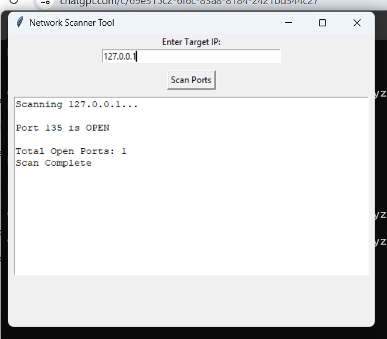

# 🔐 Log File Analyzer (Cybersecurity Project)

A Python-based security tool designed to analyze system logs and detect suspicious activities such as brute-force attacks and malicious IP addresses.
## 🚀 Features
- Detects multiple failed login attempts
- Identifies brute-force attacks
- Extracts suspicious IP addresses
- Generates automated security reports
- Includes GUI for easy interaction
## 📸 Screenshots

### Log Analyzer

### Network Scanner

