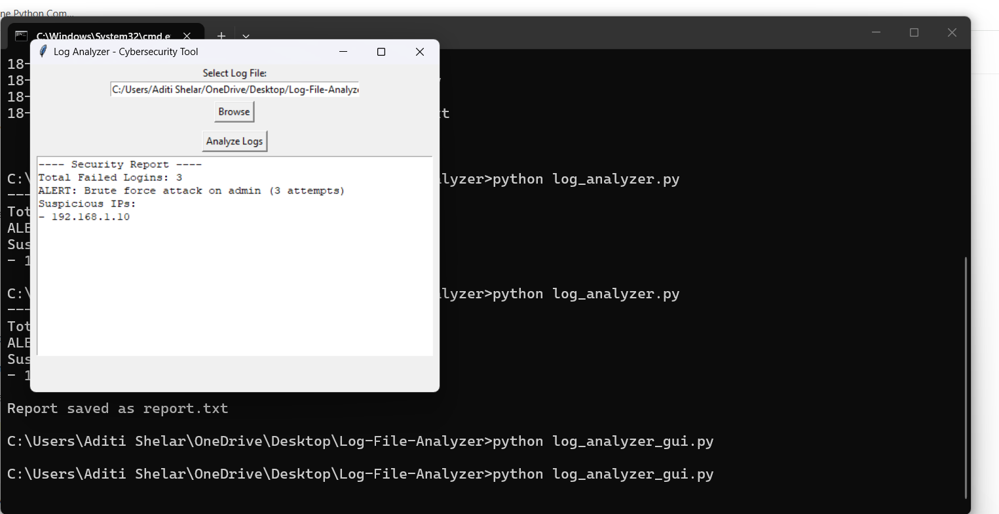

## 🔐 Auto-Detect Log Analyzer

A Python-based cybersecurity tool that analyzes log files and detects suspicious activities such as failed login attempts and brute-force attacks.

### 🚀 Features
- Auto-detects log format (Web logs, Authentication logs)
- Detects unauthorized access attempts (401 errors)
- Identifies brute-force patterns based on IP activity
- Supports large log files efficiently
- GUI-based file upload using Tkinter

### 🛠️ Technologies Used
- Python
- Regex
- Tkinter
## 📸 Screenshots

### Log Analyzer

### Network Scanner

